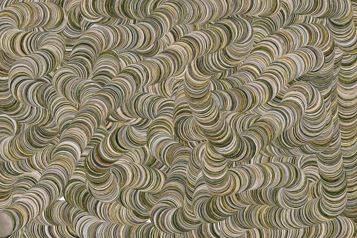
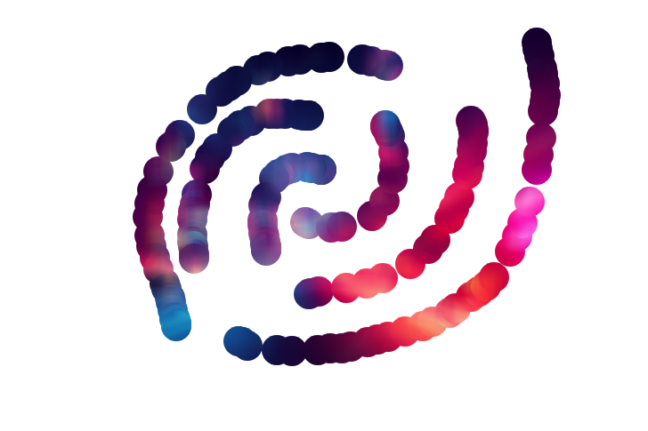
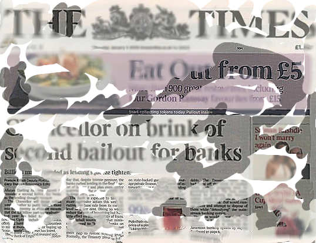

# 
This repository contains the *Pic2Paint* web app, designed for image-based painting. It was created for the VIN course at BUT FIT in 2024.

The application is available **[online](https://davidchocholaty.github.io/tools/pic2paint/)**.

## Introduction

*Pic2Paint* is an innovative tool that bridges digital art and computational creativity, designed to help artists and enthusiasts recreate images on a digital canvas with precision and flexibility. By sampling colors from an original image, *Pic2Paint* offers an interactive and intuitive painting experience that combines the essence of traditional painting techniques with modern image processing.

This tool allows users to select an image as a base, sample specific color palettes, and paint directly onto a canvas with various brush styles. Users can adjust brush settings, experiment with different color sampling modes, and watch as their creation develops to closely mirror the original reference image or take on a unique, creative interpretation.

## Installation

Follow these steps to set up *Pic2Paint* on your local machine.

### 1. Requirements

Before you begin, ensure you have the following installed:

- **Node.js** (version 14 or higher)
- **npm** or **yarn** package manager
- **TypeScript** (globally installed)

To check if Node.js and npm are installed, run the following commands:

```bash
node -v
npm -v
```

To install TypeScript globally, use:

```bash
npm install -g typescript
```

### 2. Clone the Repository

Clone the Pic2Paint repository from GitHub:

```bash
git clone https://github.com/davidchocholaty/Pic2Paint
cd pic2paint
```

### 3. Install Dependencies

Install the project dependencies using npm or yarn:

```bash
# Using npm
npm install

# Using yarn
yarn install
```

### 4. Build the Project

Compile the TypeScript code to JavaScript:

```bash
npm run build
```

This will create a ```dist``` folder with the compiled JavaScript files.

### 5. Run the Application

To start the application in development mode:

```bash
npm run start
```

Or, to run it with hot-reloading (if available):

```bash
npm run dev
```

### 6. Access the Application
Once the application is running, you can access Pic2Paint by opening your browser and navigating to ```http://localhost:3000``` (or the designated port in your configuration).

## Usage

This section describes how to use *Pic2Paint*. Once the application is open:

1. Upload an Image:

    Click the "Upload Image" button and select an image from your device.

2. Adjust Canvas Settings:

    Use the controls to set your preferred brush size and brush type.

    Brush Types:
    - **Continuous** (default): Provides a smooth, unbroken line for fluid drawing.
    - **Circle**: Creates circular strokes for more defined and rounded effects.
    - **Square**: Produces square strokes, useful for creating sharp edges.


3. Apply Effects:

    Choose from different effect types and adjust their strengths to achieve the desired look.

    Available Effects:
    - **Blur**: Softens the image, creating a dreamy appearance.
    - **Sharpen**: Enhances edges and details for a crisper look.
    - **Edge Detection**: Highlights edges, emphasizing shapes and contours in the image.

4. Select Sampling Options:

    Choose your preferred sampling method and direction.

    Methods:
    - **Normal**: Standard sampling method for general use.
    - **Vertical**: Samples the image vertically, column by column.
    - **Horizontal**: Samples the image horizontally, row by row.
    - **Random**: Randomly samples pixels across the input image, allowing for abstract and unique effects.

    Direction (for the Vertical or Horizontal method **only**):
    - **Forward**:
    - **Backward**:

5. Draw on the Canvas:

    Use the drawing tools to create your artwork on the canvas.

6. Undo/Redo Actions:

    Use the "Go Back" and "Go Forward" buttons to navigate through your drawing history.

7. Clear or Save Your Drawing:

    Click "Clear Drawing" to reset the canvas, or "Save Drawing" to download your masterpiece.

8. Access Help:

    Click the help button for guidance on using the application features (the button redirects to this section).

## Use Cases and Examples

The *Pic2Paint* web app is versatile and can be used for various artistic and creative purposes. Below are some common use cases, along with examples to illustrate how the app can be effectively utilized.

### Examples

#### Life Path


#### Storm


#### Genesis


#### Skyline


## Contributing
If you'd like to contribute to *Pic2Paint*, please fork the repository and submit a pull request. Your contributions are welcome!

## Acknowledgments
This project was made possible through the support and inspiration provided by Mgr. Tomáš Staudek, Ph.D., who leads the *Computer Art* course at the Faculty of Information Technology, Brno University of Technology. His guidance and the knowledge gained in his course were instrumental in the development of *Pic2Paint*.

## License
This project is licensed under the MIT License - see the [LICENSE](LICENSE) file for details.
